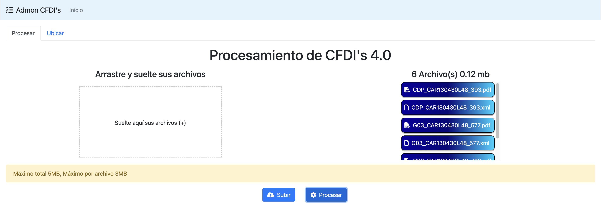
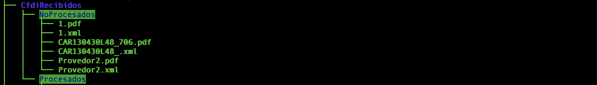

<div align="center" id="top"> 

  <!-- <a href="https://opensource.netlify.app">Demo</a> -->
</div>

<h1 align="center">Administrador de CFDI's 4.0</h1>

<p align="center">
  

  

  

  

  <!--  -->

  <!--  -->

  <!--  -->
</p>

<!-- Status -->

<!-- <h4 align="center"> 
	🚧  OpenSource 🚀 Under construction...  🚧
</h4> 

<hr> -->

<p align="center">
  <a href="#dart-Acerca">Acerca</a> &#xa0; | &#xa0;
  <a href="#rocket-tecnología">Tecnología</a> &#xa0; | &#xa0;
  <a href="#white_check_mark-requerimientos">Requerimientos</a> &#xa0; | &#xa0;
  <a href="#checkered_flag-inicio">Inicio</a> &#xa0; | &#xa0;
  <a href="#memo-license">Licencia</a> &#xa0; | &#xa0;
  <a href="https://github.com/jlpm-mex" target="_blank">Author</a>
</p>

<br>

## :dart: Acerca
Esta sencilla aplicación web te ayuda a ordenar y clasificar de manera conveniente los archivos pdf y xml de tus comprobantes Fiscales digitales por internet CFDI en la version 4.0.

La manera más facil y rápida de implementar este proyecto es a  tráves Docker. Clonando el repositorio tendrás todo los requerimientos necesarios para poder administrar tus facturas.


## :rocket: Tecnología

La siguientes herramientas fueran utilizadas en este proyecto:

- :whale: [Docker](https://www.docker.com/)

## :white_check_mark: Requerimientos

Antes de iniciar :checkered_flag:, necesitas tener instalado :whale: [Docker](https://www.docker.com/).

## :checkered_flag: Inicio

```bash
# Clonar este proyecto
$ git clone https://github.com/jlpm-mex/cfdiadmon_docker

# Accesar
$ cd admon_cfdi

# Crear la estructura de donde se leeran y almacenaran los cfdi's
$ mkdir -p CfdiRecibidos/NoProcesados CfdiRecibidos/Procesados

# Opcionalmente mejorar seguridad, cambiando en el archivo .env el valor de la varible myPasswd= 123456 <- cambiar por el valor deseado 
$ nano .env

# Si se mejoro la seguridad en el paso anterior, editar la variable spring.datasource.password=123456 del application.properties del back
$ nano back/resources/application.properties 

# Ejecutar docker compose para el levantamiento de los contenedores necesarios
$ sudo docker compose up -d
```

Abrir un navegador web, e ir a la ip del servidor en el puerto **9087**, o en caso de ser la misma computadora seria http://localhost:9087.



Dentro de la carpeta admon_cfdi existe una carpeta llamada **CfdiRecibidos**, la cuál contiene 2 carpetas mas llamadas **NoProcesados** y **Procesados**, para que la aplicación encuentre los cfdis y los procese, es necesario poner tanto el PDF como el XML a procesar en la carpeta **NoProcesados y estos se deben llamar de la misma manera**.



## :memo: License

Este proyecto se encuentra bajo licencia del MIT. para mas detalles, vea el archivo de [LICENSE](LICENSE.md).


Made with :heart: by <a href="https://github.com/jlpm-mex" target="_blank">Jose Luis Pino</a>

&#xa0;

<a href="#top">Back to top</a>
